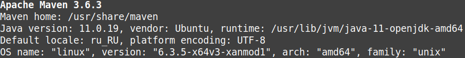

# Тестовое задание EasyBot
### Backend для магазина торгующего компьютерами и комплектующими
### Функционал:
- Добавление товара;
- Редактирование товара;
- Просмотр всех существующих товаров по типу;
- Просмотр товара по идентификатору.

### Используемые технологии:
- Java 11
- Spring 5.3.27
- Spring Boot 2.7.12
- База данных H2
- Liquibase
- MupStruct 1.5.5
- Lombok 1.18.28
- Maven

### Установка и запуск приложения

#### Для запуска приложения предварительно необходимо установить Java и Maven 


### Linux
- Для Ubuntu/Mint команда установки

``sudo apt install openjdk-11-jdk maven``

- Для Fedora команда установки

``sudo dnf install java-11-openjdk maven``

Проверка установленной версии Java

```java --version```


Проверка установленной версии Maven

```mvn --version```



### Скачивание приложения и и его запуск

```git clone https://github.com/lupaev/onlineShopComputerParts.git && cd onlineShopComputerParts && mvn spring-boot:run```

#### Api через swagger: http://localhost:8080/swagger-ui/index.html)

#### Для запуска приложения через JAR файл необходимо выполнить следующую команду

``mvn install && java -jar target/*.jar``


#### Данные БД
- Логин: user
- пароль: 1234


